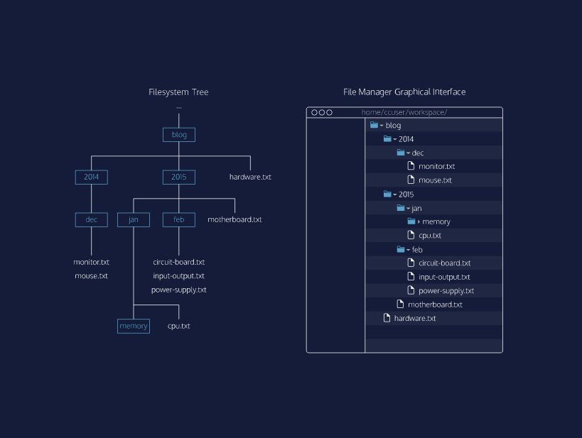
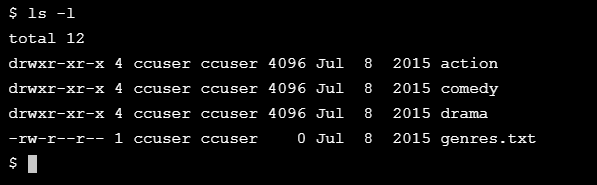
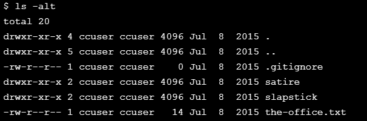
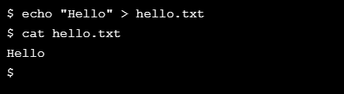
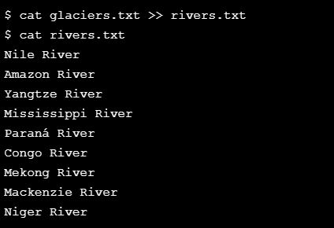
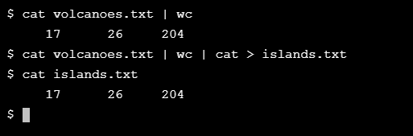
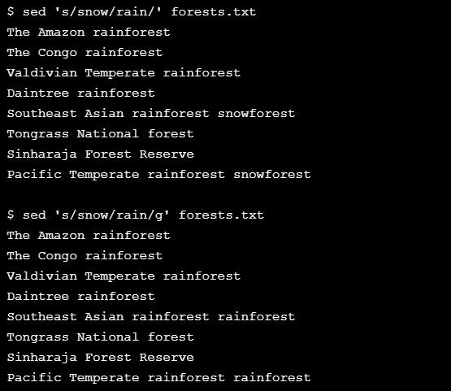

# Learn-Command-Line

Discover the power of this simple yet essential text-based tool and increase your productivity as a developer.

The command line is a text interface for your computer. It’s a program that takes in commands, which it passes on to the computer’s operating system to run.

## LESSON 1 Navigating the File System

Begin using the command line by learning how to navigate directories and files.

Exercises

- [x] 1. Your First Command

- [x] 2. ls

- [x] 3. Filesystem

- [x] 4. pwd

- [x] 5. cd I

- [x] 6. cd II

- [x] 7. mkdir

- [x] 8. touch

## LESSON 2 Manipulation (Viewing and Changing the File System)

Learn how to copy, move, and delete files and directories from the command line.

Exercises

- [x] 1. ls, revisited

- [x] 2. ls -a

- [x] 3. ls -l

- [x] 4. ls -alt  

- [x] 5. cp I

- [x] 6. cp II

- [x] 7. Wildcards

- [x] 8. mv

- [x] 9. rm

## LESSON 3 Redirecting Input and Output

Learn how to redirect input and output to and from files and programs.

Exercises

- [x] 1. Redirection

- [x] 2. stdin, stdout, and stderr

- [x] 3. Your first redirect

- [x] 4. >

- [x] 5. >>

- [x] 6. <

- [x] 7. |

- [x] 8. sort

- [x] 9. uniq

- [x] 10. grep I

- [x] 11. grep II

- [x] 12. sed

